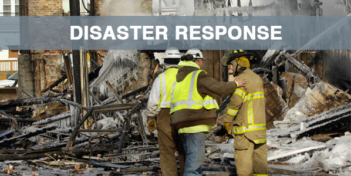

# Disaster Response Pipeline by Choco

### Table of Contents

1. [1. Project Motivation](#ProjectMotivation)
2. [2. Libraries](#Libraries)
3. [3. File Description](#FileDescription)
4. [4. Instructions](#Instructions)
5. [5. Analysis](#Analysis)
6. [6. Results](#Results)
7. [7. Licensing, Authors, and Acknowledgements](#Licensing)

## 1. Project Motivation 

This project helps to analyze disaster data using a web app that classifies disaster messages 

## 2. Libraries 
* pandas
* numpy
* sqlalchemy
* matplotlib
* plotly
* NLTK
* sklearn
* joblib
* flask

## 3. File Description 

    .
    ├── app     
    │   ├── run.py                           # Flask file that runs app
    │   └── templates   
    │       ├── go.html                      # Classification result page of web app
    │       └── master.html                  # Main page of web app    
    ├── data                   
    │   ├── disaster_categories.csv          # Dataset including all the categories  
    │   ├── disaster_messages.csv            # Dataset including all the messages
    │   └── process_data.py                  # Data cleaning
    ├── models
    │   └── train_classifier.py              # Train ML model
    ├── images
    │   └── disaster_response.jpg             # Project banner 
    └── README.md

## 4. Instructions 
1. Run the following commands in the project's root directory to set up your database and model.

    - To run ETL pipeline that cleans data and stores in database
        `python data/process_data.py data/disaster_messages.csv data/disaster_categories.csv data/DisasterResponse.db`
    - To run ML pipeline that trains classifier and saves model
        `python models/train_classifier.py data/DisasterResponse.db models/classifier.pkl`

2. Run the following command in the app's directory to run your web app.
    `python run.py`

3. Go to http://0.0.0.0:3001/

## 5. Analysis 
*Data Preparation*
- Modify the Category csv; split each category into a separate column
- Merge Data from the two csv files (messages.csv & categories.csv)
- Remove duplicates and any non-categorized valued
- Create SQL database DisasterResponse.db for the merged data sets

*Text Preprocessing*
- Tokenize text
- Remove special characters
- Lemmatize text
- Remove stop words

*Build Machine Learning Pipeline*
- Build Pipeline with countvectorizer and tfidtransformer
- Test pipeline with multioutput classifier with random forest 
- Train Pipeline (with Train/Test Split)
- Print classification reports and accuracy scores

*Improve Model*
- Use GirdSearchCV to find best parameters

*Export Model as .pkl File*
- Could also use Joblib for model export

## 6. Results 
1. ETL pipeline to read data from two csv files, clean data, and save data into a SQLite database
2. Machine learning pipeline to train a multi-output classifier on the various categories
3. Flask app to classify any message that users would enter on the web page

## 7. Licensing 
Thanks to Udacity for the starter code and FigureEight for providing the data set to be used by this project.

